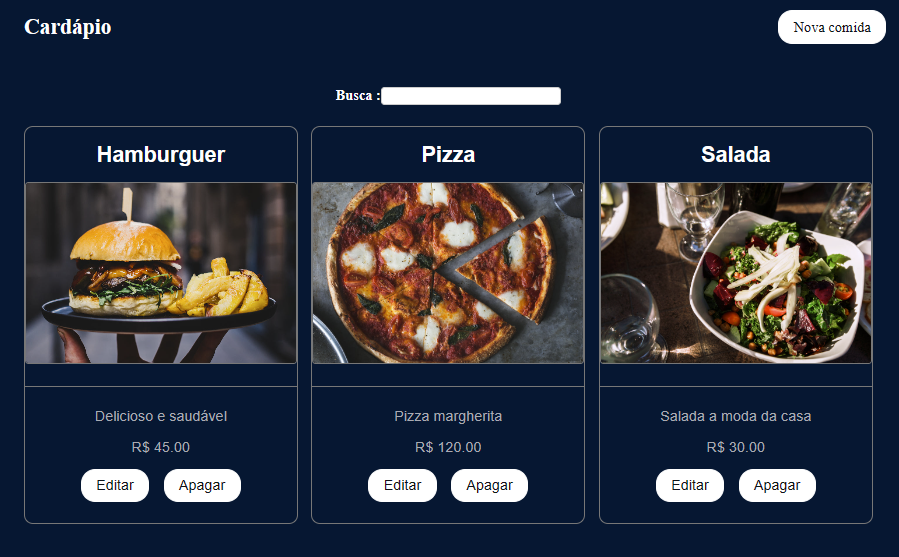
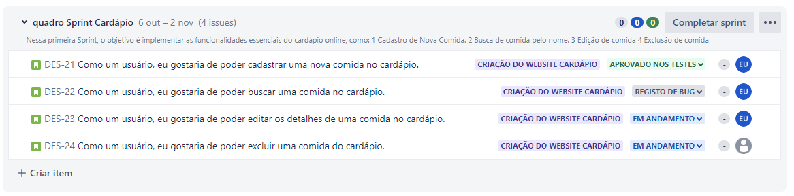
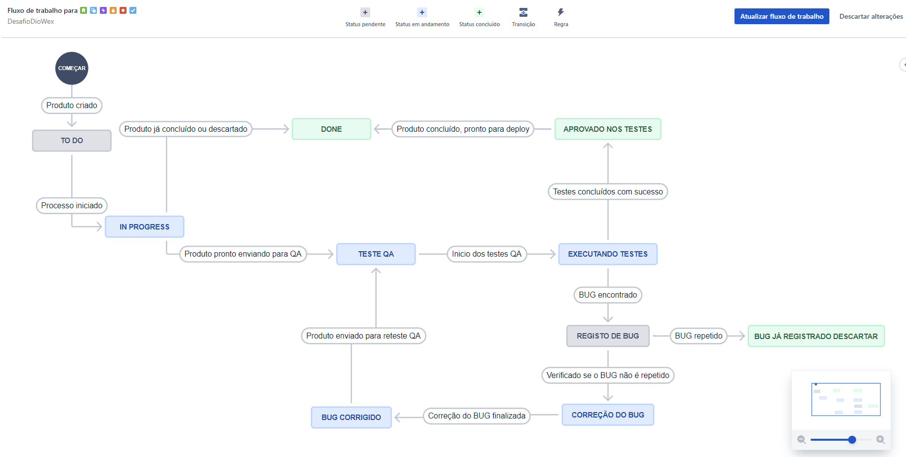

# Cardápio Online (Projeto usado como base para o desafio)
* Este é um website de cardápio online que permite aos usuários cadastrar, buscar, editar e excluir pratos do cardápio.

# Status do quadro sprint 

# Plano de fluxo de trabalho

